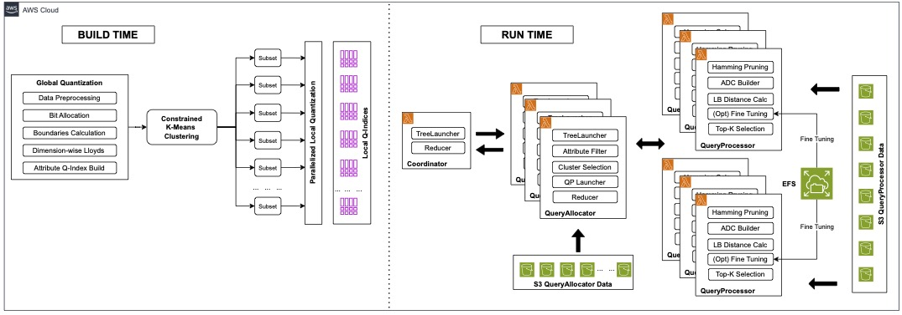
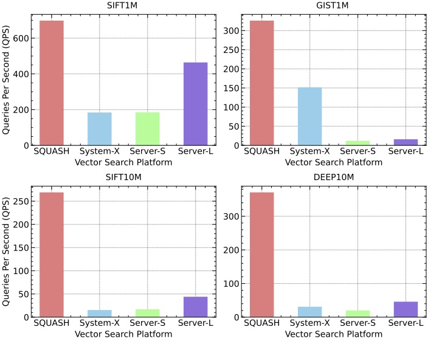
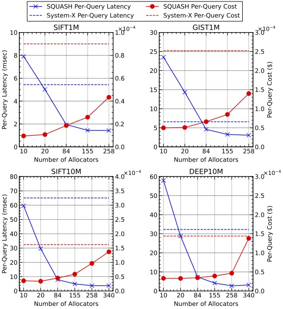

# SQUASH
This is a repository for SQUASH: Serverless Quantization-based Unified Attributed Similarity Search at High Dimensionality. SQUASH is the first fully serverless vector database with support for hybrid queries. It features a novel unified quantization-based approach for attributes and vectors, and achieves significantly higher performance than alternative vector search solutions at lower cost.

## SQUASH Architecture



## Repository Overview
This repository contains 3 packages:

- SQUASH_BUILD: Index construction module. Performs Constrained K Means clustering, before building scalar quantization-based indices in parallel for all partitions.
- SQLAYER: Used to construct the SQUASH Lambda layer, which is imported into each Lambda application used by the system. Contains code for coordinators, query allocators and query processors.
- SQUASH_MP: Alternative SQUASH implementation, developed for non-FaaS execution. Does not utilize Lambda layers, and spawns additional processes for query allocators/processors rather than invoking Lambda functions.

## Datasets
- The datatsets we evaluate SQUASH against are SIFT1M, GIST1M, SIFT10M and DEEP10M. They can be downloaded from the following sources:
    - http://corpus-texmex.irisa.fr
    - https://www.cse.cuhk.edu.hk/systems/hash/gqr/datasets.html

## Experimental Results  
Performance       |  Cost-to-Performance Balance
:-------------------------:|:-------------------------:
  |  

***
# SQUASH_BUILD

## Folder Structure
```script
- datasets: Used to store datasets and generated indices. One subfolder per dataset.
- logs: Build logs are automatically written here, and we recommend that command line output is also redirected here.
- output: General output area.
- scripts: Contains scripts to generate uniform attributes, as well as queries with a given selectivity level.
- src:
    - attributeset.py: Indexing attribute data
    - base.py: Used for pipelining successive processing steps.
    - dataset.py: Calculates KLT transformation matrix for a dataset/partition.
    - transformed.py: Performs KLT, and contains several utility functions (e.g., to perform random reads)
    - qsession.py: Top-level class coordinating the execution of other components.
    - vaqindex.py: Main indexing class. Performs SQ indexing of data (e.g., energy calculations, non-uniform bit allocations, boundary initialization, Lloyd's algorithm), as well as binary quantization.
- auto_build.sh: Used for automating multiple build jobs.
- param_template.json: Parameter template for use with auto_build.sh
- runprvd.py: Used to print detailed information about a given vector ID.
- sb_auto_runner.py: Runner script for use with auto_build.sh
- sb_runner.py: Standard runner script, used for individual build jobs.
```

## Dependencies
The following package versions were used for SQUASH_BUILD.
```script
- python==3.9
- numpy==1.24.3
- k_means_constrained==0.7.3
- bitarray==2.5.1
- boto3==1.34.82
```

## Instructions
We recommend running the SQUASH_BUILD module on a moderately-sized server for improved efficiency. A range of instance types with different cost/performance profiles are available via AWS EC2 (https://aws.amazon.com/ec2/pricing/).
- Once a given dataset XX has been downloaded, place it in the SQUASH_BUILD/datasets/XX directory. Only the raw dataset (fvecs file) is required at this stage (e.g. sift1m, no extensions.)
- If attributes are not provided with a given dataset, uniform attributes can be generated using scripts/generate_attributes.py
- Next, sb_runner.py should be configured accordingly. This includes providing dataset information (# vectors, # dimensions, # attributes, # partitions), as well as SQUASH-specific parameters (e.g., bit budget). The max_workers parameter to ProcessPoolExecutor can be used to dictate the number of partitions to be processed in parallel, following the initial Constrained K Means phase. This is dependent on the available compute resources.
    - As mentioned above, sb_auto_runner.py and param_template.json can be used in conjunction with auto_build.sh if multiple successive build jobs are required (e.g., for different datasets or for parameter testing). Create a unique directory for each build job, and copy param_template.json (configured accordingly) into each.
- Run sb_runner.py. The datasets/XX directory will be populated with several files shared amongst partitions (e.g. XX.ptnrvars.npz for partitioner variables), as well as partitions/0, partitions/1, ... directories containing the local quantization indices for each partition.
- Optionally, queries of a given selectivity level can also be generated. 
    - This can be done using scripts/generate_querydata.py. 
    - These can be split over a specified number of query-parallel 'allocators', as discussed in the paper.
    - The generate_querydata.py script creates allocators/0, allocators/1, ... directories within the given dataset folder, each containing the queries for a given allocator.
    - Note that the selectivity criteria assume that the uniform attribute generation script has been used. 
- Finally, the generated files should be uploaded to AWS, for use with SQLAYER
    - Run sqfiles_reduced.sh to generate a minimal zip of the files to be stored in EFS. Note that the extra files not included here are intermediate files generated by the build process.
    - We recommend creating an S3 bucket (e.g. squash_data_bucket) containing two folders, one being a holding area for file zips, and one for datasets themselves (i.e., the files directly accessed from S3 at runtime)
    - Run squash_aws_cli_upload.py to upload the zip to S3. This will later be transferred to EFS and unzipped for use with SQLAYER. 
    - Run dataset_transfer to upload the allocators/partitions directories for a given dataset, as well as qavars.npz, to squash_data_bucket/datasets/XX.
***
# SQLAYER

## Folder Structure
```script
- app
    - sqlayer
        - src
            - __init__.py
            - coordinator.py
            - datamanager.py
            - globals_qa.py
            - globals_qp.py
            - queryallocator.py
            - queryprocessor.py
            - sq_allocator_lambda_function.py
            - sq_coordinator_lambda_function.py
            - sq_processor_lambda_function.py
            - treelauncher.py
        - __init__.py
    - README.md
    - __init__.py
- LICENSE
- outline.md
- publish_lambda_layer_version.sh
- README.md
- run.py
- sample_sift1m_coordinator_payload.json
- setup.py
```

## Prerequisites
To run SQUASH using SQLAYER, you will require:
- An AWS account
- The AWS CLI to be installed (https://docs.aws.amazon.com/cli/latest/userguide/getting-started-install.html). 
- The AWS CLI must be configured to connect to your AWS account (https://docs.aws.amazon.com/cli/latest/userguide/cli-configure-quickstart.html)
- Access to the AWS SDK Boto3 for Python - automatically included if using AWS Cloud9 (Cloud-based IDE)

## Dependencies
The following package versions were used for SQLAYER.
```script
- python==3.11.9
- numpy==2.0.0
- boto3==1.34.148
- botocore==1.34.148
- s3transfer==0.10.2
- setuptools==70.1.0
- wheel==0.43.0
```

## Instructions - Creating Lambda Layer
- We recommend the use of AWS Cloud9 (cloud-based IDE  - https://aws.amazon.com/cloud9/) for simplified deployment and configuration of AWS services.
- Within a Cloud9 environment (or alternative), create the following folder structure:
    - efs
    - packaging
        - sqlayer
        - publish_lambda_layer_version.sh
- Copy the contents of the SQLAYER directory in this repository to the sqlayer directory listed above, and place publish_lambda_layer_version.sh accordingly.
- Create a python virtual environment within the packaging directory, at the same level as sqlayer. We recommend naming it sqvenv. sqvenv should contain the packages listed above.
- Run publish_lambda_layer_version.sh to create the AWS Lambda layer.

## Instructions - Configuring other AWS services
- Create an IAM role with the following policies:
    - AmazonElasticFileSystemClientFullAccess
    - AmazonElasticFileSystemFullAccess
    - AmazonS3FullAccess
    - AWSLambda_FullAccess
    - AWSLambdaBasicExecutionRole
    - AWSLambdaVPCAccessExecutionRole
    - CloudWatchFullAccessV2
    - A custom policy enabling 's3:*' access for Lambda functions
        - "Resource": "arn:aws:lambda:*:*:function:*"
    - A custom policy enabling Lambda functions to invoke other Lambda functions
        - "Resource": "arn:aws:lambda:*:*:function:*"
        - "Effect": "Allow",
            - "Action": [
                - "lambda:InvokeFunction",
                - "lambda:InvokeAsync"
    - Note that stricter permissions must be applied in a production setting.
- Create an EFS file system.
    - Create two access points, both at / .  The first has POSIX user 1001 : 1001, the second has 0 : 0.
- Configure a VPC such that Lambda functions, EFS and S3 are able to access each other.
- Create a series of Lambda functions, as described in the paper
    - A coordinator function (sq-coordinator-lambda)
    - An allocator function (sq-allocator-lambda)
    - A series of processor functions - create as many as the number of partitions used at build time
        - sq-processor-lambda-0
        - sq-processor-lambda-1
        - sq-processor-lambda-(# partitions - 1)
    - Each Lambda function should be assigned the IAM role described above. 
    - The EFS file system should be mounted to all Lambdas. The allocator and processors should be given the first access point (see above), and the coordinator should be given the second (to enable EFS write access). The mount point should be /mnt/squash for all functions.
    - The Lambda layer should be applied to all functions.
    - Inside SQLAYER/app/sqlayer/src are sq_allocator_lambda_function.py, sq_coordinator_lambda_function.py and sq_processor_lambda_function.py. The contents of these scripts should be copied to the respective Lambda function (this is most easily done in the AWS console). This acts as the handler function for each Lambda application, and calls the relevant parts of sqlayer as required.
- Having performed these steps, now navigate to globals_qa.py in sqlayer (in Cloud9). Update self.QA_LAMBDA_ARN and self.QP_LAMBDA_ARNS with the ARNs of the newly created allocator and processor Lambdas accordingly.

## Preparing to run
### Data Uploads
- S3: The dataset files should have already been uploaded to S3 during the build phase. Ensure that for dataset XX, the partitions/allocators directories, as well as qavars.npz, are held at squash_data_bucket/datasets/XX/ .
- EFS: 
    - The zip of required files should have also been uploaded to squash_data_bucket/reqfile_zips/ during build time. Now, in Cloud9, open a terminal, and run the following command to mount the EFS file system to the local efs directory:
        - sudo mount -t efs fs-FILE_SYSTEM_ID:/ efs
        - The file system ID can be found on the AWS console.
    - Within the EFS filesystem, create a datasets directory and navigate into it.
    - Obtain the S3 URI of the reqfile from the S3 console, and run the following command to copy it to the datasets directory in EFS:
        - aws s3 cp S3_URI_OF_REQFILE_ZIP .
    - Unzip the reqfile into datasets, such that the folder structure is now:
        - efs
            - datasets
                - XX
                    - partitions
                        - 0
                        - 1
                        - ...
### Execution Payload
A JSON payload is also required as input to the coordinator. A sample payload can be found in SQLAYER (sample_run_payload.json). Configure this as follows:

```script
- exp_tag: Set to a meaningful name to identify a given experimental run. 
- exp_run: Set to 0/1/2/3... to indicate which run # this is. SQUASH results are the average of 3 runs.
- Mode = A used for standard query runs. Mode = P prints detailed vector information for a given set of vector IDs specified below (vecs_to_print).
- The dataset parameters (e.g. # vectors) must match those of the indexed dataset.
- precision: approx_bqlb (use binary quantization, followed by lb ranking - recommended), approx_lb (perform lb ranking for all vectors), exact (visit all partitions, calculate LB/UB for all vectors, produce exact query results by visiting records on disk in ascending LB order)
- inmem_vaqdata: inmem_columnar recommended.
- adc_or_sdc: Perform asymmetric distance calculations (ADC - recommended), or symmetric (SDC - queries also quantized).
- bq_cutoff_perc: H_{perc} in the paper.
- check_recall: Compare results against ground truth and calculate overall recall.
- num_allocators: Must match specified number of allocators. If the number of allocators needs to be changed after build time, generate_querydata.py can be run in mode R, and upload_queries.py script can be run instead of dataset_transfer.py.
- bfr, l_max should be configured in order to produce the specified number of allocators, based on our tree-based invocation scheme described in the paper. For bfr b and l_max l, the number of allocators = b^1 + b^2 + ... + b^l
- fine_tune: Whether to perform fine-tuning to further boost recall (recommended)
- centroid_factor: Partition centroid distance threshold described in the paper.
- k_factor: Fine tuning factor R described in paper.
- vecs_to_print: Prints details of specific vectors if mode == P, otherwise in mode A this can be ignored.
- level = 0
- caching = False recommended
- use_s3 = True. Required with above description of dataset upload. We recommend using a hybrid storage solution of S3 and EFS as described in the paper. If you want to use EFS only, then use sqfiles.sh and follow the procedure above to move that zip to EFS.
- s3_bucket: Set to bucket name, squash_data_bucket recommended.
- qa_params: Set num_partitions accordingly.
```

### Running SQUASH
- Invoke the sq-coordinator-lambda function, passing the JSON payload in as input. This can be done from the AWS CLI, or using the console.
- The metrics file will be saved to EFS by the coordinator function.
- Detailed logs are available in CloudWatch for debugging.

***
# SQUASH_MP
This is the "multiprocessing" version of the SQUASH run-time (i.e. query-time) system. It can be executed on cloud-provisioned servers such as those provided by AWS EC2, local (on-premise) servers (physical or virtual) and even workstations/PCs, assuming they have sufficient processing capacity.

## Folder Structure
```script
- datasets: Used to store datasets and generated indices. One subfolder per dataset.
- logs: Runtime logs are automatically written here, and we recommend that command line output is also redirected here.
- output: General output area
- scripts: 
    - generate_querydata.py : Generates query sets, ground truth files and deployment files for a dataset      
- src:
    - coordinator.py: Coordinator class 
    - datamanager.py: DataManager class, provides support functionality for QueryAllocator/QueryProcessor classes
    - queryallocator.py: QueryAllocator class
    - queryprocessor.py: QueryProcessor class
    - treelauncher.py: TreeLauncher class, used by Coordinator and QueryProcessor to manage Lambda tree
- Driver script (free-standing):
    - smp_runner: This script enables configuration of runtime parameters and launch of a query session
```

## Dependencies
The following package versions were used for SQUASH_MP.
```script
- python==3.11.9
- boto3==1.34.82
- numpy==2.0.0
- bitarray==2.5.1
```

## Instructions
Before running this code, SQUASH_BUILD must have been used to build the required SQUASH indexes and support files. The relevant folder should then be copied from SQUASH_BUILD/datasets into SQUASH_MP/datasets.  

If query data has not already been generated, the generate_querydata.py script can now be used. This builds the global query data file, creates an "allocators" sub-directory under the dataset, and populates it with *num_allocators* sub-directories containing the subset query data for each allocator. Note that using the (R)ebuild mode, the number of allocators can be increased/decreased and the query workload re-subsetted accordingly.

To execute SQUASH_MP, update the smp_runner.py script to specify:

**Dataset details** including path, name, number of vectors etc
**Runtime parameters** as described in SQLAYER    

Then run smp_runner.
